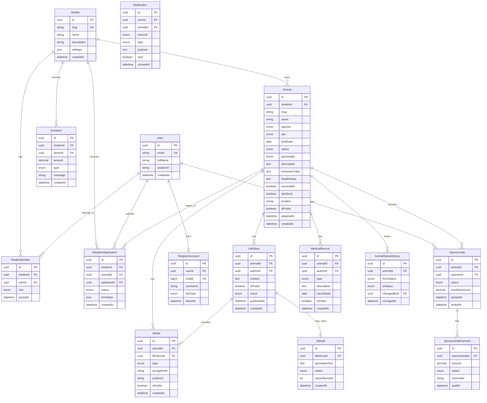
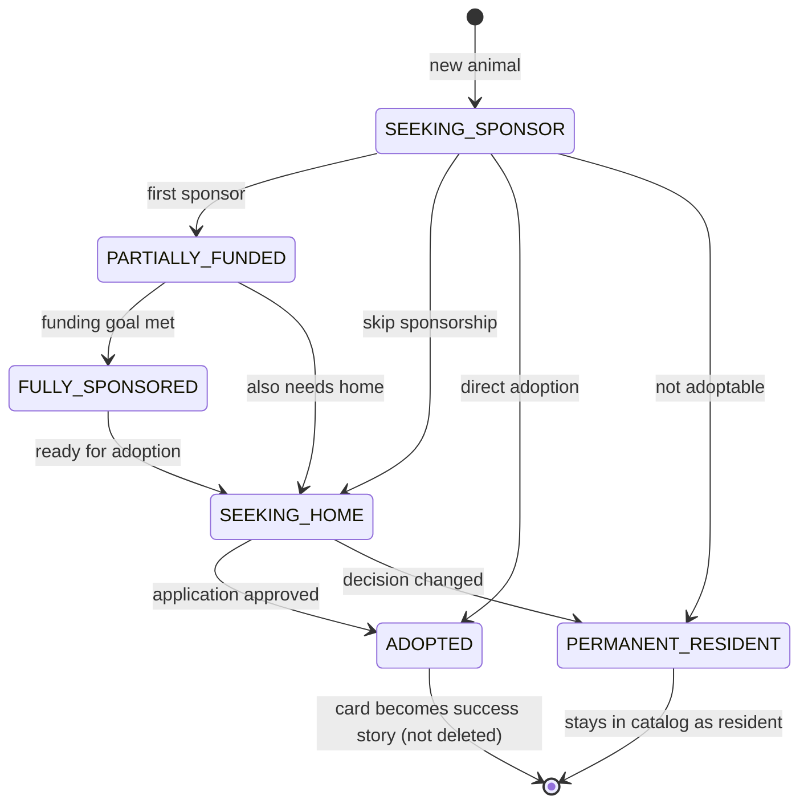

# KotoXata — Entity-Relationship Diagram

## Core Entities Overview



---

## Relationship Summary

| From | To | Cardinality | Notes |
|------|-----|-------------|-------|
| Shelter | Animal | 1:N | Tenant boundary |
| Shelter | ShelterMember | 1:N | Staff access |
| User | ShelterMember | 1:N | User can belong to multiple shelters |
| User | Sponsorship | 1:N | Sponsor role |
| Animal | LifeStory | 1:N | Timeline entries |
| Animal | Media | 1:N | Photos/videos (may link to story) |
| Animal | MedicalRecord | 1:N | Vet entries (future: restricted) |
| Animal | Sponsorship | 1:N | Multiple sponsors allowed (partial funding) |
| LifeStory | AiDraft | 1:0..1 | Draft before publish |
| User | TelegramAccount | 1:0..1 | One chat per user per bot type |

---

## Status State Machine (Animal)



---

## Indexes Strategy

```sql
-- Tenant scoping (every query)
CREATE INDEX idx_animals_shelter ON animals(shelter_id);
CREATE INDEX idx_animals_shelter_status ON animals(shelter_id, status);
CREATE INDEX idx_animals_shelter_slug ON animals(shelter_id, slug);

-- Public catalog
CREATE INDEX idx_animals_public ON animals(shelter_id, is_public, status) 
  WHERE is_public = true;

-- Sponsor lookups
CREATE INDEX idx_sponsorships_sponsor ON sponsorships(sponsor_id, status);
CREATE INDEX idx_sponsorships_animal ON sponsorships(animal_id, status);

-- Timeline
CREATE INDEX idx_life_stories_animal ON life_stories(animal_id, published_at DESC);

-- Telegram
CREATE UNIQUE INDEX idx_telegram_chat ON telegram_accounts(chat_id, bot_type);
```
