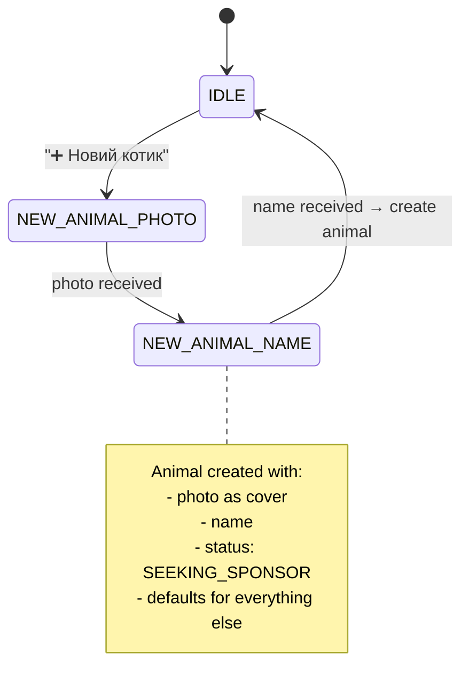
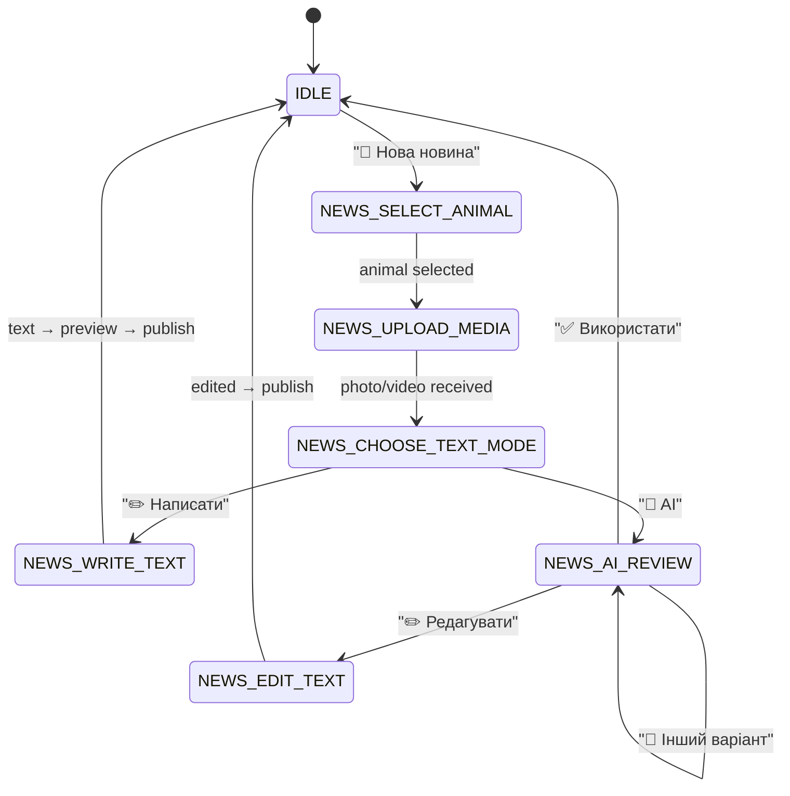

# KotoXata — Telegram Bot Architecture

Two independent bots with separate webhook endpoints and conversation state machines.

---

## 1. Bot Overview

```
┌─────────────────────────────────────────────────────────────────┐
│                     TELEGRAM PLATFORM                           │
├────────────────────────────┬────────────────────────────────────┤
│      @KotoXataBot         │      @KotoXataVolunteerBot        │
│      (Sponsor Bot)         │      (Volunteer Bot)               │
│                            │                                    │
│  "Tamagotchi experience"   │  "30-second actions"               │
│  Emotional connection      │  Create cats, post news            │
│  View updates, donate      │  AI-assisted content               │
└─────────────┬──────────────┴──────────────────┬─────────────────┘
              │                                  │
              ▼                                  ▼
   /api/webhooks/telegram/sponsor    /api/webhooks/telegram/volunteer
              │                                  │
              └──────────────┬───────────────────┘
                             ▼
                    Telegram Router
                    (validate secret, parse update)
                             │
              ┌──────────────┼──────────────┐
              ▼              ▼              ▼
         Command         Callback       Message
         Handler         Handler        Handler
              │              │              │
              └──────────────┼──────────────┘
                             ▼
                    Session FSM (DB-backed)
                             │
                             ▼
                      Domain Services
```

---

## 2. Sponsor Bot — UX Flow

### Main Screen (linked sponsor with 1+ animals)

```
🐈 Мурчик
😺 Настрій: чудовий
🍗 Добре поїв
☀️ Любить засмагати
❤️ Завдяки вам уже 9 місяців у безпеці

[📷 Фото] [🎥 Відео] [🩺 Здоров'я]
[💬 Новини] [❤️ Допомогти]

◀️ Барсик ▶️   ← swipe between sponsored animals
```

### Commands

| Command | Action |
|---------|--------|
| `/start` | Welcome; if unlinked → registration instructions |
| `/link CODE` | Link Telegram to website account |
| `/cats` | List sponsored animals |
| `/help` | Help text |

### Callback Actions

| Button | Action |
|--------|--------|
| 📷 Фото | Show latest 5 photos (gallery) |
| 🎥 Відео | Show latest videos |
| 🩺 Здоров'я | Show public health summary |
| 💬 Новини | Show latest 3 life stories |
| ❤️ Допомогти | Deep link to payment page |
| ◀️ / ▶️ | Navigate between animals |

### Notification Push (proactive)

When volunteer publishes a life story:
```
🐈 Мурчик написав вам:

"Привіт ❤️ Сьогодні я цілий день 
ніжився на сонечку..."

[📷 Фото] [💬 Ще новини]
```

---

## 3. Volunteer Bot — UX Flow

### Main Menu (linked volunteer)

```
🐾 KotoXata — Панель волонтера
Притулок: Кото Львів

[➕ Новий котик]
[📰 Нова новина]
[🐈 Мої котики]
[⚙️ Налаштування]
```

### FSM: New Animal (3 steps, <30 sec)



**Messages:**
```
Step 1: "Надішліть фото нового котика 📷"
Step 2: "Як його/її звати?"
Step 3: "✅ Мурчик доданий! Картку можна доповнити в CRM."
       [📰 Додати новину] [➕ Ще котик]
```

### FSM: New Life Story



**AI Review Screen:**
```
🤖 AI пропонує текст від імені Мурчика:

"Привіт ❤️
Сьогодні я цілий день ніжився на сонечку.
А ще знайшов нову коробку 😸"

[✅ Використати]
[✏️ Редагувати]
[🎲 Інший варіант]
[❌ Скасувати]
```

### Commands

| Command | Action |
|---------|--------|
| `/start` | Welcome + main menu |
| `/link CODE` | Link account |
| `/newcat` | Start new animal flow |
| `/news` | Start news flow |
| `/cancel` | Reset FSM to IDLE |

---

## 4. Technical Implementation

### Webhook Handler

```typescript
// src/app/api/webhooks/telegram/volunteer/route.ts

export async function POST(req: Request) {
  const secret = req.headers.get('X-Telegram-Bot-Api-Secret-Token')
  if (secret !== env.TELEGRAM_VOLUNTEER_WEBHOOK_SECRET) {
    return new Response('Unauthorized', { status: 401 })
  }

  const update: TelegramUpdate = await req.json()
  await volunteerBot.handleUpdate(update)
  return new Response('OK')
}
```

### Session Management

Sessions stored in `telegram_sessions` table (not in-memory — required for Railway horizontal scaling).

```typescript
interface SessionContext {
  animalId?: string
  mediaFileId?: string
  draftId?: string
  draftText?: string
}

async function getSession(chatId: bigint, botType: TelegramBotType) {
  let session = await prisma.telegramSession.findUnique({
    where: { chatId_botType: { chatId, botType } }
  })
  if (!session || session.expiresAt < new Date()) {
    session = await prisma.telegramSession.create({
      data: { chatId, botType, state: 'IDLE', expiresAt: addHours(new Date(), 24) }
    })
  }
  return session
}
```

### File Upload Flow

```
Telegram photo → getFile API → download from Telegram CDN
    → upload to Supabase Storage
    → create Media record
    → return publicUrl
```

---

## 5. Multi-Tenant Bot Strategy

| Phase | Strategy |
|-------|----------|
| **MVP** | Single platform bot pair; shelter resolved from user's ShelterMember |
| **V2** | Shelter can customize bot display name & avatar via BotFather |
| **SaaS** | Optional: shelter provides own bot token → stored in `Shelter.telegramVolunteerBotToken` |

When shelter has custom token:
```typescript
function getBotToken(shelter: Shelter, botType: TelegramBotType) {
  const custom = botType === 'VOLUNTEER'
    ? shelter.telegramVolunteerBotToken
    : shelter.telegramSponsorBotToken
  return custom ?? env.PLATFORM_BOT_TOKEN
}
```

---

## 6. Error Handling

| Scenario | Bot Response |
|----------|-------------|
| Unlinked user tries action | "Спочатку прив'яжіть акаунт: petshelter.app/link" |
| Session expired | Reset to IDLE, show main menu |
| Upload failed | "Не вдалось завантажити фото. Спробуйте ще раз." |
| AI unavailable | "AI тимчасово недоступний. Напишіть текст вручну ✏️" |
| Permission denied | "У вас немає доступу до цього притулку." |

---

## 7. Bot Libraries

**Recommendation:** `grammy` (TypeScript-first, middleware, conversations plugin)

```typescript
import { Bot, session } from 'grammy'
import { conversations, createConversation } from '@grammyjs/conversations'

const bot = new Bot(env.TELEGRAM_VOLUNTEER_BOT_TOKEN)

bot.use(session({ initial: () => ({}) }))
bot.use(conversations())
bot.use(createConversation(newAnimalConversation))
bot.use(createConversation(newStoryConversation))
```

Alternative: raw Bot API calls (lighter, more control) — acceptable for MVP.

---

## 8. Deployment Notes

- Webhooks require HTTPS → Railway provides this automatically
- Set webhook on deploy: `scripts/setup-telegram-webhooks.ts`
- Webhook URL: `https://petshelter.app/api/webhooks/telegram/{type}`
- Enable `secret_token` for security
- Allowed updates: `message`, `callback_query`, `edited_message`
